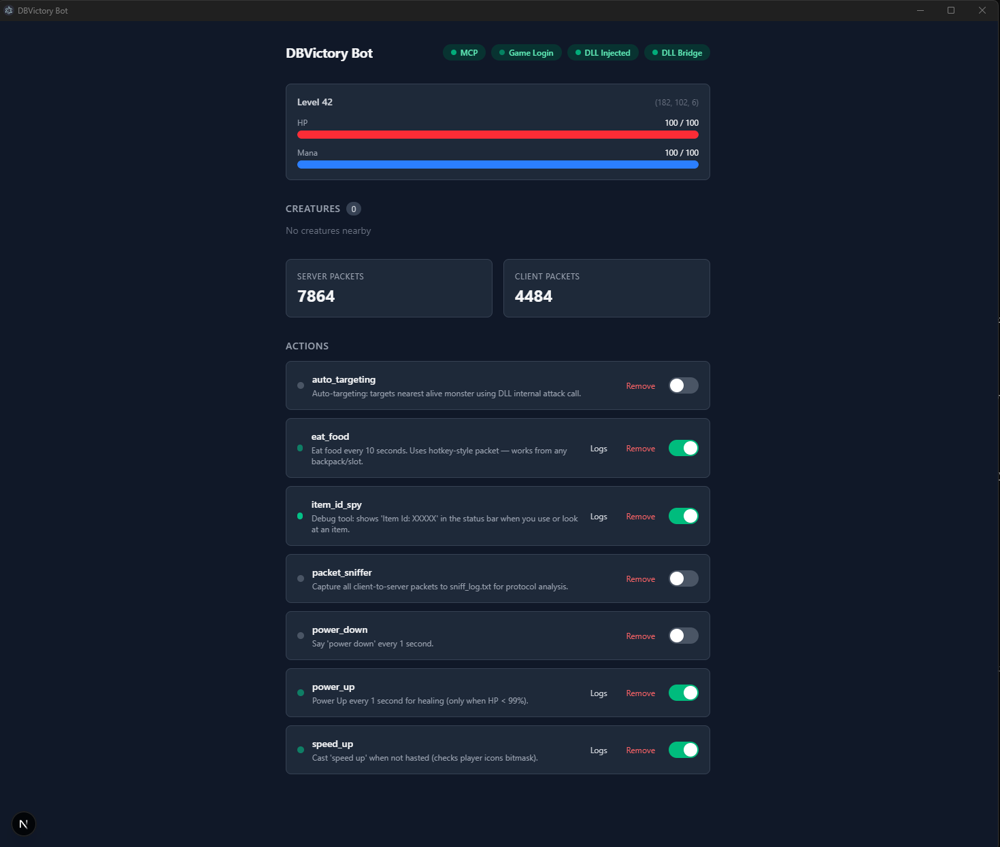
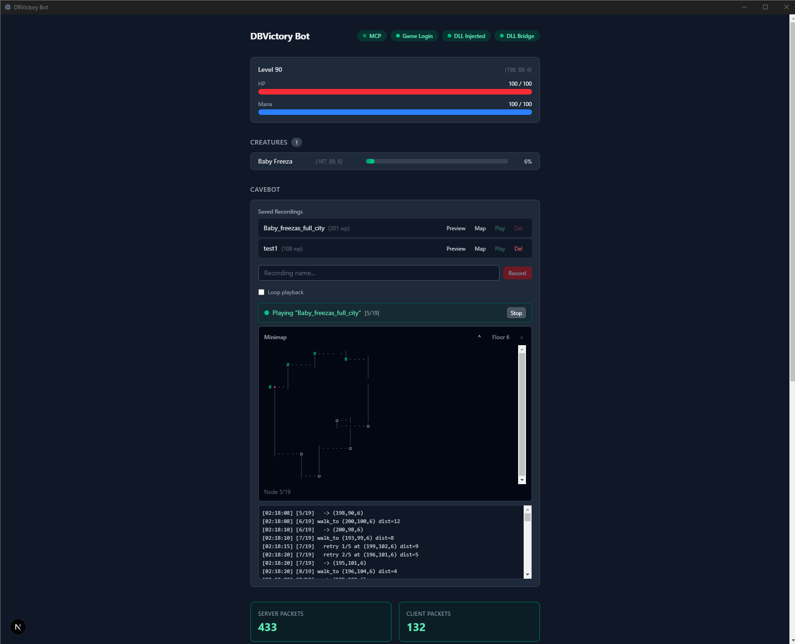

# DBVictory Bot

A man-in-the-middle proxy bot for the DBVictory game, controlled through Claude Code via MCP (Model Context Protocol). Features DLL injection for real-time creature tracking, in-game targeting, automated healing/buffing, and a live Electron dashboard.





## Features

- **MITM Proxy** — intercepts and decrypts all game traffic using XTEA encryption keys
- **DLL Injection** — reads creature battle list directly from game memory via `std::map` tree walk
- **In-Game Targeting** — calls `Game::attack()` internally so the red targeting square appears in-game
- **Real-Time Dashboard** — Electron + Next.js app with WebSocket updates every 100ms, showing player stats, creatures, packet counts, and action controls
- **Automated Actions** — pluggable Python scripts that run in the background (healing, buffing, eating, targeting)
- **Full Game State** — parses server packets for HP, mana, level, position, creatures, and text messages
- **Claude Code Control** — natural language commands via MCP tools (walk, attack, say, use items)
- **HP Reading from DLL** — reads player health directly from game memory for fast, reliable healing triggers
- **Dead Creature Filtering** — automatically filters out 0% HP creatures from game state

## How It Works

1. The game client (`dbvStart.exe`) normally connects to `87.98.220.215`
2. The bot patches the client's memory to redirect traffic through `127.0.0.1`
3. A local proxy intercepts login/game traffic, extracts XTEA encryption keys, and injects packets on demand
4. A DLL is injected into the game process to read creature data and enable in-game targeting
5. Claude Code sends commands to the MCP server, which translates them into game packets

### Architecture

```
You (Claude Code)
    │
    │ MCP protocol (tools: walk, attack, say...)
    ▼
mcp_server.py ──────────────────────────────┐
    │                                       │
    ├── proxy.py ◄──► Game Client ◄──► Game Server
    │     │                │
    │     │ decrypts       │
    │     │ via crypto.py  │
    │     │                │
    │     ▼                │
    │  protocol.py         │
    │     │                │
    │     ▼                │
    │  game_state.py       │
    │     ▲                │
    │     │                │
    ├── dll_bridge.py ◄────┤ named pipe ◄── dbvbot.dll (injected)
    │                      │                    │
    ├── actions/*.py       │                    ├── hooks XTEA encrypt
    │   (eat, attack,      │                    ├── walks creature map tree
    │    sniff, heal)      │                    ├── calls Game::attack()
    │                      │                    └── sends data to Python
    │                      │
    └── dashboard_api.py ──┤──► dashboard/ (Electron + Next.js)
                           │
                        bot.py (BotContext — what actions use)
```

## Automated Actions

The bot supports pluggable background actions — Python scripts in the `actions/` folder that run continuously while connected. Each action has an `async def run(bot)` entry point.

| Action | Description |
|--------|-------------|
| **auto_targeting** | Targets the nearest alive monster using DLL internal `Game::attack()` call (100ms loop) |
| **eat_food** | Eats food (red ham) every 10 seconds using hotkey-style packets — works from any backpack/slot |
| **power_up** | Says "power up" every 1 second for healing, only when HP is below 99% |
| **speed_up** | Casts "speed up" when not hasted — detects haste via player icons bitmask |
| **power_down** | Says "power down" every 1 second to cancel healing buff |
| **auto_rune** | Uses rune 3165 on the currently targeted creature every 1 second |
| **cavebot** | Records and replays navigation paths with live minimap visualization |
| **packet_sniffer** | Captures all client-to-server packets to `sniff_log.txt` for protocol analysis |
| **item_id_spy** | Debug tool: shows "Item Id: XXXXX" in the game status bar when you use or look at an item |
| **full_light** | Patches the game client to skip the darkness overlay entirely |

Actions can be toggled on/off from the dashboard UI or via MCP tools. Enabled actions auto-start when the bot connects.

### Writing Custom Actions

Create a `.py` file in `actions/` with an `async def run(bot)` function:

```python
"""Eat food every 10 seconds. Uses hotkey-style packet — works from any backpack/slot."""
import sys, os
sys.path.insert(0, os.path.dirname(os.path.dirname(os.path.abspath(__file__))))
from protocol import build_use_item_packet

FOOD_ID = 3583    # red ham on DBVictory
INTERVAL = 10

async def run(bot):
    while True:
        if bot.is_connected:
            pkt = build_use_item_packet(0xFFFF, 0, 0, FOOD_ID, 0, 0)
            await bot.inject_to_server(pkt)
        await bot.sleep(INTERVAL)
```

The `bot` object provides:

```python
bot.use_item_in_container(item_id, container, slot)  # use item from backpack
bot.use_item_on_map(x, y, z, item_id, stack_pos)     # use item on ground
bot.say(text)                                          # send chat message
bot.walk(direction, steps, delay)                      # walk in a direction
bot.inject_to_server(packet)                           # send raw packet
bot.sleep(seconds)                                     # async sleep
bot.is_connected                                       # connection status
bot.hp / bot.max_hp / bot.mana                         # player stats
bot.position                                           # (x, y, z)
bot.creatures                                          # nearby creatures
bot.log(msg)                                           # log to stderr
```

## Dashboard

The Electron dashboard provides real-time visibility into the bot's state:

- **Status badges** — MCP, Game Login, DLL Injected, DLL Bridge connection status
- **Player stats** — Level, HP/Mana bars, position coordinates
- **Creatures list** — Nearby creatures with HP percentage
- **Packet counters** — Server and client packet counts
- **Action controls** — Toggle, view logs, and remove actions directly from the UI

The dashboard connects via WebSocket (`ws://127.0.0.1:8090`) for 100ms update intervals, with an HTTP API (`http://127.0.0.1:8089`) for action mutations.

## DLL Injection System

The injected DLL (`dll/dbvbot.dll`) provides capabilities that can't be achieved through the proxy alone:

- **Creature map tree walk** — reads the `std::map<uint32, Creature*>` red-black tree directly from memory every 100ms for O(log n) creature lookup
- **In-game targeting** — calls `Game::attack()` from the game thread via WndProc hook, making the red targeting square appear natively
- **XTEA key extraction** — hooks the XTEA encrypt function to capture session encryption keys
- **HP reading** — reads player health directly from game memory

Communication between the DLL and Python happens over a named pipe (`\\.\pipe\dbvbot`). The `dll_bridge` action runs as an always-on internal service.

### Build

Requires MinGW-w64 (32-bit) since dbvStart.exe is 32-bit:

```bash
cd dll && make
```

## Available MCP Commands

### Movement
- **walk** — Move in a direction (n/s/e/w/ne/se/sw/nw)
- **autowalk** — Walk continuously in a direction
- **stop** — Stop walking
- **turn** — Face a cardinal direction

### Combat
- **attack** — Attack a creature by ID
- **follow** — Follow a creature by ID
- **set_fight_modes** — Set offensive/balanced/defensive, chase/stand, PvP/safe

### Interaction
- **say** — Send a chat message
- **use_item** — Use an item at a map position
- **move_item** — Move an item between positions
- **look_at** — Inspect a tile or item

### Actions
- **list_actions** — Show all actions with ON/OFF/running status and source preview
- **toggle_action** — Enable/disable an action
- **remove_action** — Delete an action script
- **restart_action** — Reload and restart a running action

### Cavebot
- **start_recording** — Begin recording navigation waypoints
- **stop_recording** — Stop recording and save to disk
- **list_recordings** — List all saved recordings
- **play_recording** — Replay a saved recording (with optional loop)
- **stop_playback** — Stop cavebot playback
- **delete_recording** — Delete a saved recording

### Utility
- **get_status** — Check connection state and packet stats
- **send_ping** — Ping the game server
- **logout** — Disconnect from the server

## Setup

### Requirements

- Python 3.10+
- Windows (required for memory patching and DLL injection)
- DBVictory game client (`dbvStart.exe`)
- MinGW-w64 32-bit (for DLL compilation)

### Install Dependencies

```bash
pip install pymem mcp websockets
```

### Usage

> **Important:** Claude Code must be running as Administrator for memory patching to work.

1. **Start Claude Code as Administrator** — right-click terminal, "Run as Administrator"
2. **Launch the game client** — open `dbvStart.exe`, wait at the login screen (do NOT log in yet)
3. **Ask Claude to `start_bot`** — patches memory, starts the proxy (blocks up to 2 min waiting for login)
4. **Log in through the game client** — the proxy intercepts the connection and extracts encryption keys
5. **Control your character** — give Claude natural language commands or enable automated actions

## Project Structure

```
dbv_exp/
├── mcp_server.py          ★ Main entry point — MCP server for Claude Code
├── proxy.py               Network MITM proxy (XTEA decrypt/encrypt)
├── protocol.py            OT protocol packet parser
├── crypto.py              XTEA encryption implementation
├── bot.py                 BotContext class for actions
├── game_state.py          Live game state (HP, creatures, position)
├── patcher.py             Patches game client memory
├── inject.py              DLL injector (LoadLibrary via CreateRemoteThread)
├── dll_bridge.py          Python ↔ DLL named pipe communication
├── dashboard_api.py       REST + WebSocket API for dashboard
│
├── dll/
│   ├── dbvbot.cpp         Injected DLL (creature scan, Game::attack, XTEA hook)
│   └── dbvbot.dll         Compiled DLL
│
├── actions/
│   ├── dll_bridge.py      Always-on DLL bridge service
│   ├── auto_targeting.py  Auto-target nearest monster via Game::attack()
│   ├── eat_food.py        Periodic food consumption
│   ├── power_up.py        Healing when HP < 99%
│   ├── speed_up.py        Haste buff with icon bitmask detection
│   ├── auto_rune.py       Auto-rune on targeted creature
│   ├── cavebot.py         Navigation recording and playback
│   ├── full_light.py      Darkness overlay patch
│   ├── power_down.py      Cancel healing buff
│   ├── packet_sniffer.py  Packet capture to file
│   └── item_id_spy.py     Item ID debug display
│
├── dashboard/
│   ├── app/               Next.js pages (React UI)
│   ├── lib/               Shared utilities
│   └── electron/          Electron wrapper (desktop app)
│
├── cavebot.py             Cavebot engine (recording, actions map, minimap)
├── recordings/            Saved cavebot navigation recordings
├── docs/                  Research notes and analysis
├── offsets.json           Centralized game offsets (DLL reads via pipe)
└── bot_settings.json      Persisted action settings
```

## Cavebot TODO

The cavebot is a first working version but not yet fully functional:

### Bugs
- [ ] **Stairs recording incorrect** — floor transitions via stairs/ramps are not always captured properly in recordings, causing playback to fail at floor changes

### Planned Features
- [ ] **Monster combat strategies** — move-and-attack behavior that keeps 1 square distance from the monster while fighting
- [ ] **Real item usage support** — shovel, rope, and other usable items during cavebot navigation
- [ ] **Terrain testing** — verify and fix playback on doors, ladders, and other interactive map objects
- [ ] **Spell rotation** — cast attack spells on cooldown during combat
- [ ] **Loot pickup** — open corpses and move loot to backpack
- [ ] **Death handling** — detect death, pause actions, resume after respawn

### Nice to Have
- [ ] **Smart waypoint-to-action-map optimizer** — algorithm that transforms a raw recorded path into an optimized action map based on monster spawn locations. Analyzes which tiles have the highest monster density, removes redundant backtracking, and generates an efficient patrol route that maximizes kills-per-minute by prioritizing high-spawn areas and minimizing idle walking through empty corridors
- [ ] **Anti-bot / Intelligent responder** — automated system to detect and respond to anti-bot checks or GM interactions
